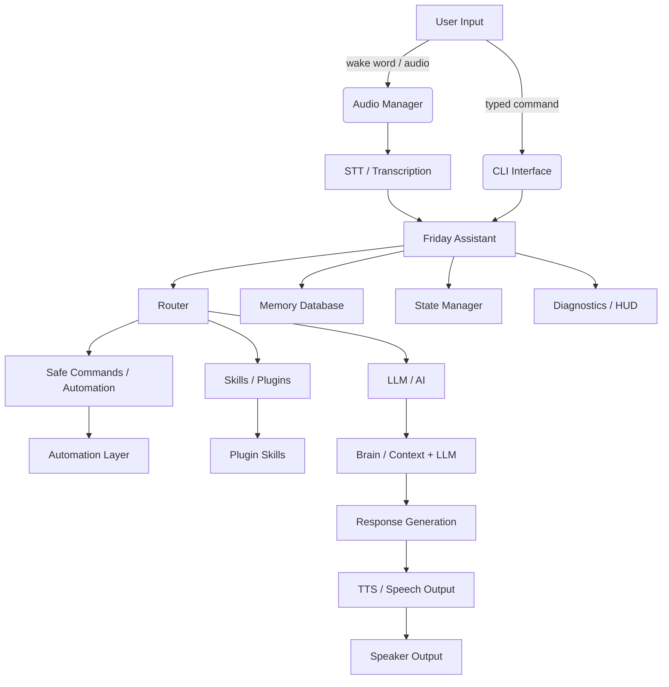

# Friday Architecture Flowchart and Tech Stack

This document explains the full Friday project architecture, the tech stack used at each layer, and the data flow for both CLI and voice modes.

---

## 1. High-Level Architecture



### Explanation
- `User Input` can be a typed command or audio input.
- `CLI Interface` is the main text-based interaction layer in `ui/cli.py`.
- `Audio Manager` coordinates microphone input, wake-word detection, transcription, and speech output.
- `Friday Assistant` (`core/assistant.py`) is the central orchestrator.
- `Router` (`core/router.py`) decides whether to run safety-mapped commands, a plugin, or an LLM response.
- `Automation Layer` performs actual system tasks via `automation/*`.
- `Plugins` are discovered automatically from `skills/plugins/`.
- `LLM / AI` is optional and powered by `brain/llm.py` and `brain/ollama_client.py`.
- `TTS` uses offline engines: `piper` if installed or `pyttsx3` fallback.
- `Memory Database` stores notes and interaction history in `memory/database.py`.
- `State Manager` tracks assistant state and activity in `core/state_manager.py`.
- `Diagnostics / HUD` supports monitoring and status display.

---

## 2. Tech Stack by Layer

### Platform
- Linux-focused, CPU-first design
- Works with ALSA / PulseAudio / PipeWire audio devices via Python libraries
- Supports optional `systemd` service packaging in `linux/systemd/friday.service`

### Python Runtime & Libraries
- Python 3.x
- `asyncio` for non-blocking event loops and concurrency
- `sounddevice` for microphone capture
- `numpy` for audio sample handling
- `pydub` for audio processing utilities
- `psutil` for system monitoring and process info
- `loguru` for logging
- `pyautogui` for GUI automation if needed
- `keyboard` for optional local keyboard automation support
- `pyyaml` for configuration loading
- `requests` for any HTTP integration
- `pyttsx3` for offline TTS fallback
- `rich` optional for better dashboard/UI displays
- `pytest` / `pytest-asyncio` for tests

### Core Modules
- `main.py` — entry point, starts CLI or voice mode
- `core/assistant.py` — central assistant orchestration
- `core/router.py` — routes commands and selects execution path
- `core/state_manager.py` — tracks mode, current task, and activity state
- `core/event_bus.py`, `core/bus.py` — asynchronous event propagation and decoupling

### UI / Interaction
- `ui/cli.py` — typed CLI loop and voice-mode control
- `ui/dashboard.py`, `ui/hud.py`, `ui/overlay.py` — terminal/overlay status display

### Voice & Audio Subsystem
- `voice/audio_manager.py` — top-level audio coordination
- `voice/microphone.py` — microphone capture interface
- `voice/tts_engine.py` — TTS engine choosing `piper` or `pyttsx3`
- `voice/stt_engine.py` — speech-to-text abstraction
- `voice/wakeword_manager.py` — wake-word detection logic
- `voice/transcription_manager.py` — silence-based transcription fallback
- `voice/streaming_transcriber.py` — streaming audio transcription with `whisper.cpp` if available
- `voice/playback_manager.py` — audio playback control and interrupts
- `voice/speech_queue.py` — prioritized speech output queue
- `voice/interrupt_handler.py` — interrupt handling for TTS and audio
- `voice/device_controller.py` — microphone/speaker ownership locking

### Automation Layer
- `automation/app_launcher.py` — launch applications safely
- `automation/browser_controller.py` — open sites, search Google/YouTube
- `automation/command_executor.py` — execute safe commands
- `automation/file_manager.py` — file operations: search, create, delete, move
- `automation/linux_controller.py` — system and process controls
- `automation/system_monitor.py` — CPU, memory, battery, network, and temperature reporting
- `automation/terminal_agent.py` — terminal-based helper actions

### Security & Safety
- `security/permission_manager.py` — tracks user confirmation for risky commands
- `security/safe_commands.py` — whitelisted safe automation commands
- `security/validator.py` — risk assessment and command validation

### Skills & Plugins
- `skills/registry.py` — skill registry and lookup
- `skills/loader.py` — automatic discovery of plugin skills
- `skills/skill_executor.py` — isolated skill execution with async timeout
- `skills/sandbox.py` — sandboxing and safe execution wrappers
- `skills/plugins/` — plugin skill implementations

### Memory & Brain
- `memory/database.py` — SQLite-based persistent storage for notes and interactions
- `memory/embeddings.py` — embedding utilities (if implemented)
- `memory/long_term.py` — long-term memory management
- `memory/retrieval.py` — recall and search over stored entries
- `memory/short_term.py` — session/history memory
- `brain/llm.py` — local LLM wrapper and fallback responses
- `brain/ollama_client.py` — optional Ollama model integration
- `brain/context_manager.py` — prompt context, memory injection, history assembly
- `brain/response_streamer.py` — token streaming and response assembly
- `brain/token_pipeline.py` — safety and token filtering

### Configuration
- `config/commands.yaml` — safe command mapping and aliases
- `config/prompts.yaml` — prompt templates and persona definitions
- `config/settings.yaml` — environment and runtime configuration

### Optional External Tools
- `openWakeWord` — keyword spotting engine
- `whisper.cpp` — CPU-based streaming STT engine
- `piper` — high-quality offline TTS engine
- `ollama` — local LLM inference backend

---

## 3. Detailed Data Flow

### 3.1 CLI Mode Flow

1. `main.py` starts `ui/cli.py` via `run_cli()`.
2. User types a command at `Friday> `.
3. CLI sends text to `FridayAssistant.handle_text()`.
4. `FridayAssistant` normalizes and logs input, then:
   - handles `remember ...` internally by saving to `memory/database.py`
   - handles memory recall requests by querying `memory/database.py`
   - forwards other text to `FridayRouter.route()`.
5. `FridayRouter` attempts plugin matching in `skills/registry.py`.
6. If a plugin skill matches, that skill is executed asynchronously.
7. If no plugin matches, the router checks `config/commands.yaml` safe command mappings.
8. For safe commands, the command is validated by `security/validator.py` and may ask for confirmation using `security/permission_manager.py`.
9. If the command is allowed, `automation/command_executor.py` executes it; other automation helpers may be used from `automation/*` modules.
10. If the command is not in the safe map and looks like a help/question, the router calls `brain/llm.py.ask()`.
11. `FridayLLM` uses `brain/ollama_client.py` if available, or returns a built-in fallback.
12. The result is saved to memory as `interaction` and returned to the CLI.
13. CLI prints the assistant response.

### 3.2 Voice Mode Flow

1. `main.py --voice` starts `ui/cli.py` `run_voice_mode()`.
2. `AudioManager.wait_for_wake_word()` uses `voice/wakeword_manager.py`.
3. When the wake word is detected, the assistant enters listening.
4. `AudioManager.listen()` is called:
   - If `whisper.cpp` is installed, `SpeechStreamingTranscriber` captures chunks via `sounddevice` and streams them to `voice/streaming_transcriber.py`.
   - Otherwise `voice/transcription_manager.py` uses silence detection and fallback transcription.
5. The captured text is forwarded to `FridayAssistant.handle_text()`.
6. The same routing and execution path from CLI mode is used.
7. The assistant response is printed and also spoken by `AudioManager.speak()`.
8. `voice/tts_engine.py` prefers `piper`; if unavailable it uses `pyttsx3`; if that also fails it prints text.

---

## 4. Flowchart: Text vs Voice Path

```mermaid
flowchart TB
    User[(User)]
    subgraph CLI
      User -->|type command| CLI[CLI Prompt]
    end
    subgraph Voice
      User -->|speak + wake word| Wake[Wake Word Detector]
      Wake -->|trigger| Mic[Audio Capture]
      Mic --> STT[Transcription]
      STT --> Assistant
    end
    CLI --> Assistant[Friday Assistant]
    Assistant --> Router[Friday Router]
    Router -->|skill match| Plugin[Plugin / Skill]
    Router -->|safe command| Safe[Safe Automation]
    Router -->|question/help| LLM[LLM / AI]
    Plugin --> Result[Result]
    Safe --> Result
    LLM --> Result
    Result -->|text output| CLI
    Result -->|TTS| TTS[Text-to-Speech Engine]
    TTS --> Speaker[Speaker Output]
    Assistant --> Memory[Memory DB]
    Assistant --> State[State Manager]
    Assistant --> Diagnostics[Diagnostics / HUD]
```

---

## 5. How Data Moves Through the System

### Entry / Input
- Text enters via `ui/cli.py`.
- Audio enters via `voice/audio_manager.py` + `sounddevice`.
- Wake-word enters via `voice/wakeword_manager.py`.

### Orchestration
- `core/assistant.py` handles all incoming messages.
- `core/router.py` decides exact behavior.
- `skills/loader.py` discovers plugins at startup.
- `security/permission_manager.py` protects confirmed risky commands.

### Execution
- Safe commands map to concrete automation handlers in `automation/*`.
- Plugin skills execute domain-specific code.
- LLM requests use `brain/ollama_client.py` or fallback logic in `brain/llm.py`.
- Responses are saved to `memory/database.py` for later recall.

### Output
- Text responses return immediately to CLI.
- Voice responses go through `voice/tts_engine.py`.
- Diagnostic state updates propagate to `ui/hud.py` or logs.

---

## 6. Module Responsibilities

### `main.py`
- Launches the assistant in text or voice mode.
- Injects local `bin/` into `PATH`.

### `core/assistant.py`
- Central actor for user requests.
- Adds chat history to state.
- Delegates command interpretation and memory storage.

### `core/router.py`
- Matches text to plugin skills.
- Executes safe automation commands.
- Falls back to LLM/help responses.

### `automation/*`
- Actual system actions: open apps, control browser, manage files, monitor system.
- Isolate OS operations from business logic.

### `voice/*`
- Manages microphone capture, transcription, wake words, and speech output.
- Supports both streaming STT and fallback audio transcription.
- Provides offline TTS support.

### `security/*`
- Prevents unsafe command execution.
- Enforces confirmation and permission tracking.

### `memory/*`
- Stores remembered notes and interaction history.
- Enables recall commands like `show memory`.

### `brain/*`
- Provides AI response generation and context handling.
- Integrates with local LLM backends when available.

---

## 7. External Integration Points

### Optional Binaries
- `whisper.cpp` — enables `voice/streaming_transcriber.py` for streaming STT.
- `piper` — preferred offline TTS engine.
- `ollama` — local LLM inference backend for richer responses.
- `openWakeWord` — optional low-latency wake-word engine.

### Configuration Files
- `config/commands.yaml` — safe command definitions and aliases.
- `config/prompts.yaml` — text prompts and assistant persona.
- `config/settings.yaml` — runtime and behavior settings.

### System Support
- `linux/systemd/friday.service` — example service file for system onboarding.

---

## 8. Glossary of Important Files

- `main.py` — entry point
- `ui/cli.py` — command prompt and voice-mode loop
- `core/assistant.py` — request orchestration
- `core/router.py` — command routing and decision engine
- `voice/audio_manager.py` — unified audio interface
- `voice/tts_engine.py` — offline speech output
- `voice/streaming_transcriber.py` — whisper-based STT path
- `automation/command_executor.py` — safe automation execution
- `memory/database.py` — persistent notes and history
- `brain/llm.py` — AI prompting and fallback
- `security/permission_manager.py` — command confirmation tracking

---

## 9. Practical Example: "open firefox"

1. `ui/cli.py` receives input `open firefox`.
2. `core/assistant.py` forwards the text to `core/router.py`.
3. `FridayRouter` does not find a plugin match, so it evaluates text patterns.
4. It recognizes `open firefox` and calls `automation/linux_controller.open_application("firefox")` in a thread.
5. The automation function launches the application and returns a result string.
6. `core/assistant.py` saves the interaction to `memory/database.py`.
7. The CLI prints the result.

---

## 10. Practical Example: Voice Mode Flow

1. User says wake word, `voice/wakeword_manager.py` detects it.
2. `voice/audio_manager.py` records microphone audio with `sounddevice`.
3. `voice/streaming_transcriber.py` converts chunks into text using `whisper.cpp` if present.
4. The transcribed text enters `core/assistant.py`.
5. The router executes the command or calls the LLM.
6. The response is sent to `voice/tts_engine.py`.
7. `piper` or `pyttsx3` speaks the response out loud.

---

## 11. Quick Dependency Map

- `Python` core runtime
- `asyncio` concurrency
- `sounddevice`, `numpy`, `pydub` for audio
- `pyyaml` for configuration
- `loguru` for logging
- `psutil` for system monitoring
- `pyttsx3` for offline TTS fallback
- Optional: `rich`, `whisper.cpp`, `piper`, `ollama`, `openWakeWord`

---

## 12. Summary

Friday is built as a layered assistant:
- Input layer: CLI or voice
- Processing layer: assistant routing, safety, skill execution, AI
- Action layer: automation actions and TTS output
- Storage layer: memory persistence
- Support layer: state tracking, diagnostics, audio device control

The architecture is intentionally modular so that:
- voice and text share the same router
- automation is separated from command interpretation
- external tools are optional, not required
- state and memory are central and reusable

This file should help you understand both the tech stack and the exact data flow through the project.
