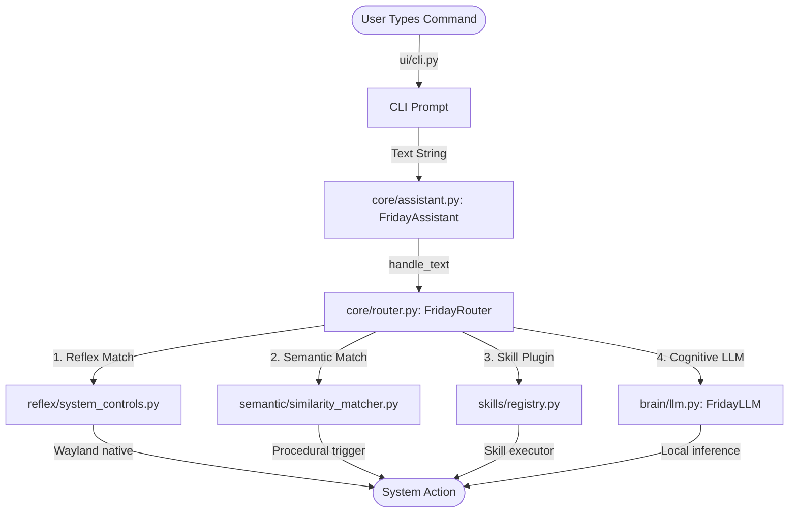
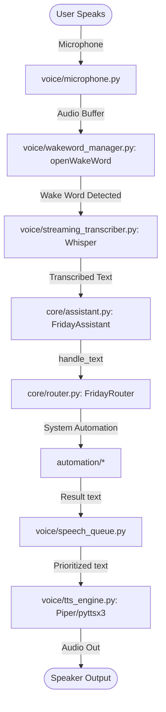
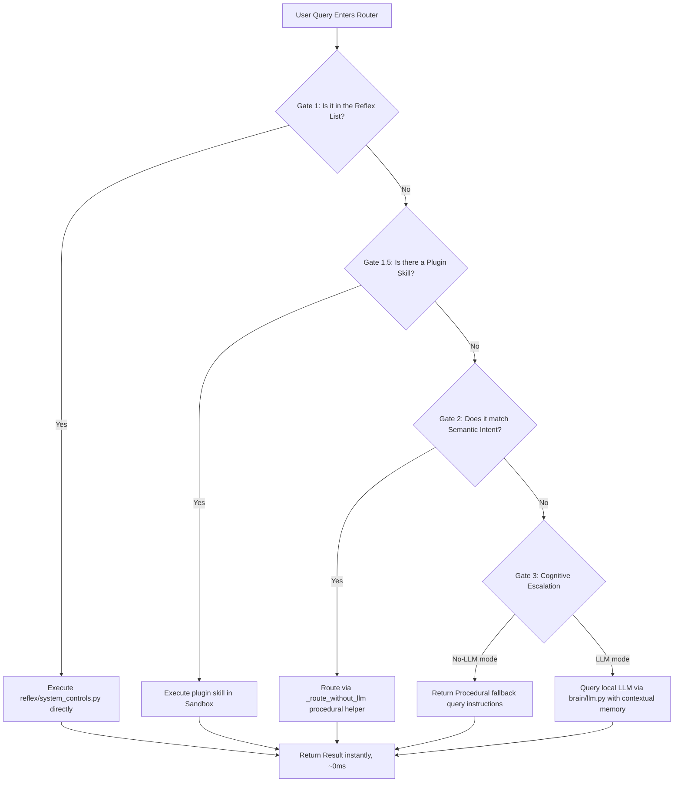

# 🌟 Friday Cognitive & Procedural OS Architecture

Welcome to the comprehensive guide to Friday's architecture. This document provides an in-depth, interactive, and highly visual representation of Friday's multi-layered intelligence system, detailing how data flows from user input to physical OS automation.

---

## 1. Interaction Paradigm: Voice vs. Text Flows

Friday supports two entry gateways: a non-blocking console-based CLI and a real-time, offline-first voice interaction loop.

---

## 2. Friday Multi-Layered Architecture Map

Below is a detailed overview mapping all systems, python packages, files, and their relational links.

```mermaid
flowchart TB
    %% Definitions %%
    subgraph Input_Layer ["1. Input Gateways"]
        CLI["CLI Prompt (ui/cli.py)"]
        Mic["Mic Capture (voice/microphone.py)"]
        Wake["Wake Word (voice/wakeword_manager.py)"]
        STT["STT Transcriber (voice/streaming_transcriber.py)"]
    end

    subgraph Orchestration_Layer ["2. Central Orchestration Layer"]
        Assist["Assistant Engine (core/assistant.py)"]
        Router["Decision Router (core/router.py)"]
        Bus["Async Event Bus (core/event_bus.py)"]
        State["State Manager (core/state_manager.py)"]
    end

    subgraph Brain_Layer ["3. Cognitive & Semantic Brain"]
        Matcher["Similarity Matcher (semantic/similarity_matcher.py)"]
        LLM["Cognitive Agent (brain/llm.py)"]
        Memory["Enhanced Memory DB (memory/enhanced_memory.py)"]
        Reasoner["Memory Reasoning (brain/memory_reasoning_engine.py)"]
    end

    subgraph Reflex_Layer ["4. Wayland-Native Reflex Layer"]
        Controls["Reflex Controls (reflex/system_controls.py)"]
        Skills["Skill Plugins (skills/registry.py)"]
    end

    subgraph Action_Layer ["5. System Automation Layer"]
        LinuxCtrl["OS Window/Apps (automation/linux_controller.py)"]
        FileMgr["FS Management (automation/file_manager.py)"]
        BrowserCtrl["Web/Media Control (automation/browser_controller.py)"]
        SysMon["System Diagnostics (automation/system_monitor.py)"]
    end

    subgraph Output_Layer ["6. Speech Synthesis Pipeline"]
        Queue["Speech Queue (voice/speech_queue.py)"]
        TTS["TTS Engine (voice/tts_engine.py)"]
    end

    %% Data Flow Links %%
    CLI -->|User text| Assist
    Mic -->|Raw audio| Wake
    Wake -->|Detected| STT
    STT -->|Transcribed text| Assist
    
    Assist -->|Assembles query| Router
    Assist -->|Saves history| Memory
    Router <-->|Event bus signals| Bus
    Router <-->|Tracks current task| State
    
    Router -->|Gate 1: Fast Reflex| Controls
    Router -->|Gate 1.5: Plugins| Skills
    Router -->|Gate 2: Semantic Similarity| Matcher
    Router -->|Gate 3: Fallback LLM / Reasoning| Reasoner
    
    Reasoner <-->|Memory read/write| Memory
    Reasoner -->|Escalate to model| LLM

    %% Action Triggers %%
    Controls -->|Execute command| LinuxCtrl
    Controls -->|Volume/brightness| LinuxCtrl
    Matcher -->|Run direct action| FileMgr
    Matcher -->|Play YouTube/Search| BrowserCtrl
    Matcher -->|Query health| SysMon
    Skills -->|Sandbox execution| FileMgr

    %% Synthesis Feedback %%
    FileMgr -->|Action feedback| Assist
    BrowserCtrl -->|Playback info| Assist
    LinuxCtrl -->|Command feedback| Assist
    
    Assist -->|Speak request| Queue
    Queue -->|Queue synthesis| TTS
    TTS -->|Play speech| Speaker([Speaker Output])

    %% Styling %%
    classDef input fill:#2b3a4a,stroke:#3b5a7a,stroke-width:2px,color:#fff;
    classDef orch fill:#3b2a4a,stroke:#5b3a6a,stroke-width:2px,color:#fff;
    classDef brain fill:#1b4a3a,stroke:#2b6a4a,stroke-width:2px,color:#fff;
    classDef reflex fill:#4a3a1b,stroke:#6a5a2b,stroke-width:2px,color:#fff;
    classDef action fill:#4a1b1b,stroke:#6a2b2b,stroke-width:2px,color:#fff;
    classDef out fill:#1b3a4a,stroke:#2b5a6a,stroke-width:2px,color:#fff;

    class CLI,Mic,Wake,STT input;
    class Assist,Router,Bus,State orch;
    class Matcher,LLM,Memory,Reasoner brain;
    class Controls,Skills reflex;
    class LinuxCtrl,FileMgr,BrowserCtrl,SysMon action;
    class Queue,TTS out;
```

---

## 3. Technology Stack & Layer Breakdown

| Layer | Responsibility | Primary Modules | Tech Stack | Latency Target | Offline Capability |
| :--- | :--- | :--- | :--- | :--- | :--- |
| **1. Input Gateways** | Captures voice triggers, streaming transcripts, and keyboard CLI commands. | `ui/cli.py`, `voice/microphone.py`, `voice/wakeword_manager.py` | `sounddevice`, `numpy`, `openWakeWord`, `whisper.cpp` | Real-time / Streaming | 100% Offline (Local Models) |
| **2. Orchestration** | Correlates user interaction, state machine, event propagation, logging, and metrics. | `core/assistant.py`, `core/router.py`, `core/state_manager.py` | `asyncio`, `loguru`, `pyyaml` | <1ms | 100% Offline |
| **4. Wayland Reflex**| 0ms latency system, media, screen, audio and active workspace mapping triggers. | `reflex/system_controls.py`, `skills/registry.py` | `wpctl`, `playerctl`, `hyprctl`, `brightnessctl` | <5ms | 100% Offline |
| **3. Brain & Memory** | Fast NLP classification, semantic database search, long/short-term memory, and local LLM. | `semantic/similarity_matcher.py`, `brain/llm.py`, `memory/enhanced_memory.py` | `SQLite3`, `ollama` (Local model backend) | 10ms - 2000ms | 100% Offline |
| **5. OS Automation** | Manages browser tabs, application execution, system reporting, and full file operations. | `automation/browser_controller.py`, `automation/file_manager.py` | `pywhatkit`, `playwright`, `psutil`, `shutil` | 2ms - 100ms | 100% Offline |
| **6. Output Pipeline** | Formats voice output, schedules synthesized speech, and manages device locking. | `voice/speech_queue.py`, `voice/tts_engine.py`, `voice/playback_manager.py` | `piper-tts`, `pyttsx3`, `sounddevice` | Real-time / Low Latency | 100% Offline |

---

## 4. Operational Gateways (How Commands are Routed)

When a command arrives at `FridayRouter.route()`, it is filtered through **three sequential security and routing gates** to achieve sub-millisecond response times for standard actions while keeping the LLM as a deep-reasoning fallback.

---

## 5. Architectural Features

### Wayland Native Reflexes (Gate 1)
Friday interacts with the desktop compositor (`Hyprland`), sound server (`PipeWire/WirePlumber`), and system timers directly via asynchronous subprocess execution. This completely bypasses intermediate window abstractions, granting a **0ms visual delay** on critical commands like desktop workspace switches, hardware brightness, and volume.

### Dual-Engine YouTube Media System
If you ask to search, it leverages a headless Playwright context to keep browsing sessions active. If you ask to *play* a song, it uses an offline-first integration using `pywhatkit` to bypass search lists, automatically launching your active browser and queueing the first audio track immediately.

### 100% Offline-First Architecture
Friday is designed to operate completely independent of the cloud. Speech-To-Text (Whisper), Text-To-Speech (Piper), Wake Word detection (openWakeWord), Semantic Matching (Levensthein-fallback), and Reasoning (Ollama local Llama models) are executed directly on the local CPU/GPU, ensuring ultimate privacy and absolute performance.

### Risk Verification & Safe Execution
Any execution of terminal shell utilities, file deletion commands, or system shutdown calls is automatically parsed by `security/validator.py` and requires confirmation via `security/permission_manager.py` before execution, ensuring absolute safety for autonomous automation workflows.
